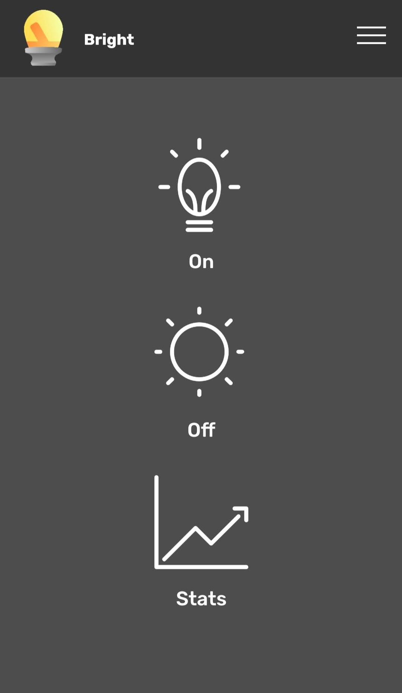
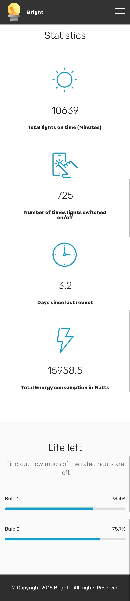
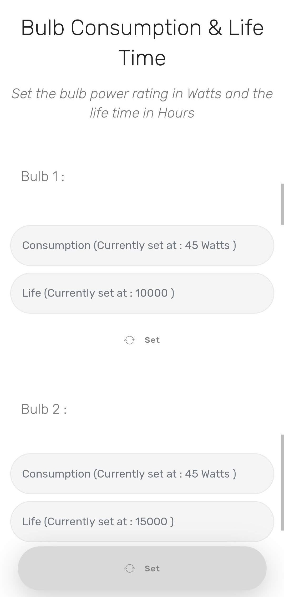
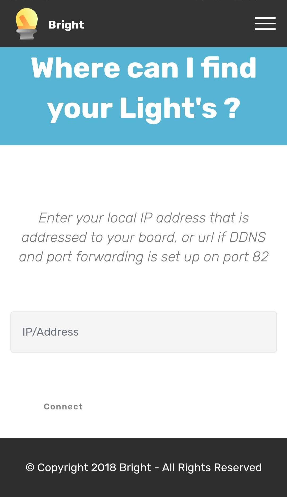

# Bright App

**Bright** is a user-friendly mobile application designed to effortlessly control your light bulb using the advanced Bright Chip technology. With a simple and intuitive interface, this app allows you to remotely manage your light bulb and provides valuable insights about its usage.

## Features

1. **Energy Usage**: Stay informed about the energy consumption of your light bulb. The Bright App tracks and displays the amount of energy used, enabling you to make more conscious decisions regarding your energy consumption.

2. **On/Off Count**: Keep track of how frequently you turn the light bulb on and off. The app records the number of times the light has been switched on and off, helping you monitor its usage patterns and estimate its lifespan.

3. **Bulb Life**: Plan ahead and optimize bulb replacement with the Bulb Life feature. The Bright App calculates and displays the estimated remaining lifespan of the light bulb in hours, providing you with a clear indication of when it may need replacement.

## User-Friendly Interface

Bright App's user interface is designed to be simple, intuitive, and visually appealing. It offers seamless navigation and effortless control over your light bulb, ensuring a delightful user experience.

Experience the convenience of managing your light bulb's energy usage, monitoring on/off frequency, and keeping track of its remaining lifespan with the Bright App. Make smarter choices, save energy, and enjoy enhanced control over your lighting system.

## App Screenshots

1. Home Screen

   

2. Statistics Page

   

3. Bulb Settings
   

4. Initial setup Page

   